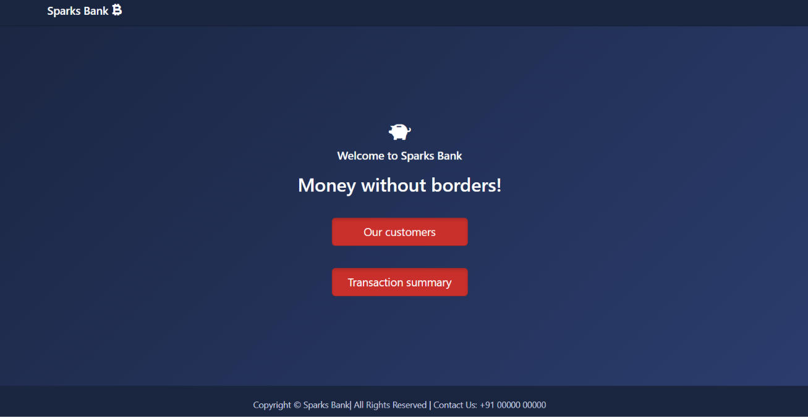
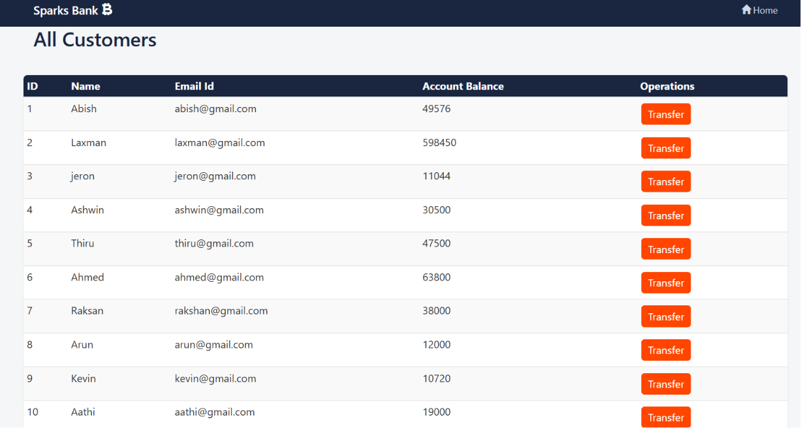
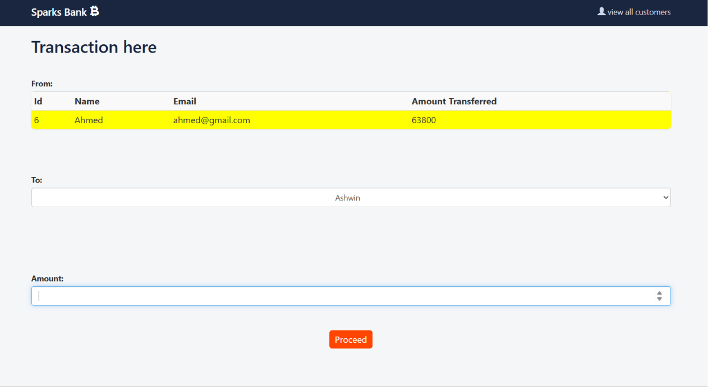

# Banking System

A simple PHP + MySQL banking demo built in 2021 as learning material for The Sparks Foundation internship program. It lets you view a list of customers, transfer credits between them, and view a transaction history.

> **Note:** This is a beginner learning project, not production code. Database credentials are hardcoded and SQL queries are not parameterized — see [Known Limitations](#known-limitations) below.

## Screenshots

| Home | All Customers | Transfer |
|---|---|---|
|  |  |  |

## Features

- View all customers and their account balances
- Transfer credits from one customer to another
- View a full transaction history
- Basic validation (blocks zero-amount and insufficient-balance transfers)

## Technologies Used

- **Frontend**: HTML, CSS (Bootstrap), JavaScript (jQuery)
- **Backend**: PHP (procedural, `mysqli`)
- **Database**: MySQL

## Project Structure

| File | Purpose |
|---|---|
| `index.php` | Landing page with links to customers and transaction summary |
| `users.php` | Lists all customers from the `users` table |
| `selectedUserdetail.php` | Shows one customer's details and handles the money transfer |
| `transaction.php` | Displays the transaction history |
| `config.php` | MySQL connection settings |
| `datatosql.php` | One-off script to seed the `users` table |
| `dd.sql` | Database schema + seed data dump (`users` and `transaction` tables) |

## Getting Started

### Prerequisites

- A local PHP + MySQL environment, e.g. [XAMPP](https://www.apachefriends.org/) or [WAMP](https://www.wampserver.com/en/), or plain PHP with a MySQL server installed.

### Setup

1. Clone the repository into your server's web root (e.g. `htdocs` for XAMPP):
   ```bash
   git clone <your-repo-url> banking-system
   ```
2. Create a database named `dd` and import the schema/seed data:
   ```bash
   mysql -u root -p dd < dd.sql
   ```
   (Or use phpMyAdmin: create a database called `dd`, then import `dd.sql`.)
3. Check `config.php` matches your MySQL setup (defaults to host `localhost`, user `root`, empty password):
   ```php
   $servername = 'localhost';
   $user = 'root';
   $pass = '';
   $dbname = 'dd';
   ```
4. Start the server:
   ```bash
   ./start.sh      # macOS/Linux
   start.bat       # Windows
   ```
   Or run it directly: `php -S localhost:8000`
5. Open `http://localhost:8000/index.php` in your browser.

## Usage

- From the home page, click **Our customers** to see all customers and their balances.
- Click **Transfer** next to a customer to send credits to another customer.
- Click **Transaction summary** (or the navbar link) to view all past transactions.

## Known Limitations

Since this was built as an early learning exercise, there are a few things worth knowing before reusing it:

- Database credentials are hardcoded in `config.php` rather than loaded from environment variables.
- SQL queries use raw string interpolation instead of prepared statements — not safe for production use.
- No authentication/authorization — anyone can transfer credits between any accounts.

## License

No license specified — add one if you plan to share or reuse this project publicly.
